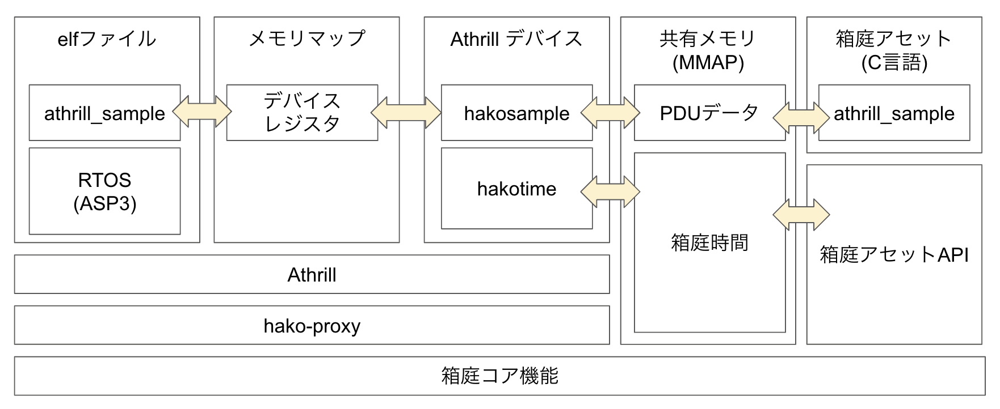

# asp3-athrill-v850e2m

このリポジトリでは、以下の内容を学び、体験することができます。

* RTOS(ASP3)上でプログラムをC言語で作成し、CPUエミュレータAthrillを使用して実行する方法
* 自作の周辺デバイスをAthrillに追加し、シミュレーション環境を拡張する方法
* 作成した周辺デバイスを箱庭コア機能と連携させ、他の箱庭アセットと通信するシステムの構築方法

## 動作環境

* macOS
* Ubuntu 22.04

dockerを利用しますので、事前にインストールをお願いします。

## 全体アーキテクチャ

以下は、システム全体のアーキテクチャを示す図です。



### アーキテクチャ概要

1. **RTOS（ASP3）とAthrillの連携**:
   - `elfファイル`は、Athrill上で動作するRTOS（ASP3）用のプログラムを格納します。このプログラムは、Athrillエミュレータ内で`athrill_sample`として実行され、RTOS上のタスクとして動作します。
   - `メモリマップ`は、Athrillがシミュレートする仮想メモリ空間を指し、ここにデバイスレジスタがマッピングされます。

2. **Athrillデバイスと周辺機器のシミュレーション**:
   - `Athrillデバイス`として、ユーザーが自作した周辺デバイスが追加されます。この例では、`hakosample`と`hakotime`というデバイスがあり、メモリマップを通じて他のコンポーネントとやり取りします。

3. **箱庭コア機能との連携**:
   - 自作したデバイスは、`共有メモリ（MMAP）`を介して箱庭コア機能と接続されます。このプロセスでは、`PDUデータ`が共有メモリにマッピングされ、箱庭コア機能とリアルタイムにデータをやり取りします。
   - `hakotime`デバイスは、Athrillと箱庭コア機能との間のシミュレーション時間を調停します。
   - `hakosample`デバイスは、学習用のサンプルデバイスです。デバイスレジスタを定義して、箱庭PDUデータへのアクセスを行えるようにします。Atrhill上で実行される`athrill_sample`は、このレジスタへのI/Oを行います。

4. **箱庭アセットとの連携**:
   - C言語で作成された箱庭アセットは、`箱庭アセットAPI`を利用して、Athrillと通信し、RTOS上のサンプルタスクと通信することができます。

### hako-proxyの役割
`hako-proxy`は、Athrillのライフサイクル管理をするコンポーネントです。Athrillを箱庭アセットして登録し、Athrillが箱庭コア機能の間の通信を行える環境をつくります。

このアーキテクチャにより、ユーザーはRTOS上でのプログラム実行から、デバイスの追加、そして箱庭コア機能との統合まで、一貫した開発とシミュレーションが可能になります。


# インストール手順

## 事前準備

最初に、以下の２つのリポジトリーをクローンしましょう。

**hakoniwa-core-cpp-client:**
```
git clone --recursive https://github.com/toppers/hakoniwa-core-cpp-client.git
```

**asp3-athrill-v850e2m:**
```
git clone --recursive https://github.com/toppers/asp3-athrill-v850e2m.git
```

dockerイメージを作成します。
```
cd asp3-athrill-v850e2m
```

```
bash docker/create-image.bash 
```

## インストール

各リポジトリに対してインストール作業を行います。

**hakoniwa-core-cpp-client:**
```
cd hakoniwa-core-cpp-client
```

箱庭コア機能およびサンプルプログラムをビルドします。
```
bash build.bash
```

箱庭コア機能をインストールします。
```
bash install.bash
```

**asp3-athrill-v850e2m:**
```
cd asp3-athrill-v850e2m
```

AthrillおよびAthrillデバイスをビルドします。なお、/usr/local/lib/hakoniwaへのライブラリコピーをしますので、パスワードが聞かれた場合は、入力をお願いします。

```
bash build-athrill.bash
```

RTOS (ASP3）およびサンプルプログラムをビルドします。

```
bash docker/build.bash athrill_sample
```

# シミュレーション実行方法

シミュレーションを実行するには、端末を３個用意する必要があります。

* 端末A：hakoniwa-core-cpp-client
* 端末B：hasp3-athrill-v850e2m
* 端末C：hakoniwa-core-cpp-client

**端末A:**
箱庭アセットを起動します。
```
 ./cmake-build/examples/athrill_sample/athrill_sample athrill_sample examples/athrill_sample/custom.json 1000
```
成功するとこうなります。

```
INFO: hako_conductor thread start
Robot: Robot, PduWriter: Robot_tx
channel_id: 1 pdu_size: 4
INFO: Robot create_lchannel: logical_id=1 real_id=0 size=4
INFO: asset(athrill_sample) is registered.
WAIT START
```

**端末B:**
Athrillを起動します。
```
bash run/exec.bash athrill_sample
```

成功するとこうなります。
```
add_option:../athrill-target-v850e2m/cmake-build/athrill2
add_option:-c1
add_option:-i
add_option:-d
add_option:./device_config.txt
add_option:-m
add_option:./memory_mac.txt
add_option:../asp3/athrill_sample/asp
INFO: PROXY start
target_channels: 0 target_channels: 4
INFO: Robot create_lchannel: logical_id=0 real_id=1 size=4
target_channels: 1 target_channels: 4
```

**端末C:**
箱庭のシミュレーションを開始します。
```
hako-cmd start
```

成功すると端末Bで、Athrillの起動ログが出力され待機状態になります。
```
pid:14051
monitring:
exec_args_count=8
the_args[0]=../athrill-target-v850e2m/cmake-build/athrill2
the_args[1]=-c1
the_args[2]=-i
the_args[3]=-d
the_args[4]=./device_config.txt
the_args[5]=-m
the_args[6]=./memory_mac.txt
the_args[7]=../asp3/athrill_sample/asp
core id num=1
ROM : START=0x0 SIZE=512
RAM : START=0x5ff7000 SIZE=512
DEV : START=0x90f0000 SIZE=1024
DEV : START=0x900f0000 SIZE=1024
ELF SET CACHE RIGION:addr=0x0 size=23 [KB]
Elf loading was succeeded:0x0 - 0x5f7d : 23.893 KB
Elf loading was succeeded:0x5f80 - 0xc828 : 0.4 KB
ELF SYMBOL SECTION LOADED:index=17
ELF SYMBOL SECTION LOADED:sym_num=553
ELF STRING TABLE SECTION LOADED:index=18
DEBUG_FUNC_HAKO_ASSET_NAME = athrill
DEBUG_FUNC_HAKO_ROBO_NAME = Robot
INFO: HakoAssetSampleDevice is initialized
DEBUG_FUNC_HAKO_ASSET_NAME = athrill
hako_time_only: 0
DEBUG_FUNC_FT_LOG_SIZE=1024
[DBG>
HIT break:0x0
EDITOR_SEARCH_PATH_0 = ../asp3/athrill_sample
[NEXT> pc=0x0 kernel_cfg_asm.S 23
```

この状態で、端末Bで`c`コマンドを入力してエンターキーを押下するとシミュレーションが進み始めます。

端末Aと端末Bとで、それぞれログ出力されます。

端末A：箱庭アセットの実行ログ
````
INFO: hako_conductor thread start
Robot: Robot, PduWriter: Robot_tx
channel_id: 1 pdu_size: 4
INFO: Robot create_lchannel: logical_id=1 real_id=0 size=4
INFO: asset(athrill_sample) is registered.
WAIT START
WAIT RUNNING
START CREATE PDU DATA: total_size= 8
PDU DATA CREATED
CREATED ADDR=0x104d9c00c
PDU CREATED
INFO: my_on_initialize enter
INFO: sleep 1sec
INFO: my_on_initialize exit
INFO: start simulation
SYNC MODE: true
hako_asset_pdu_read: 0
hako_asset_pdu_write: 0
hako_asset_pdu_read: 0
hako_asset_pdu_write: 1
hako_asset_pdu_read: 1024
hako_asset_pdu_write: 2
hako_asset_pdu_read: 1025
hako_asset_pdu_write: 3
````

端末B：Athrill上で動作するサンプルアプリとAthrillデバイスの実行ログ
````
c
[CPU>LOADED: PDU DATA
hako_client_read_pdu: ret=0 data: 0
LOADED: PDU DATA
hako_client_read_pdu: ret=0 data: 1

TOPPERS/ASP3 Kernel Release 3.2.0 for V850-ESFK3 (Aug 12 2024, 03:35:45)
Copyright (C) 2000-2003 by Embedded and Real-Time Systems Laboratory
                            Toyohashi Univ. of Technology, JAPAN
Copyright (C) 2004-2017 by Embedded and Real-Time Systems Laboratory
            Graduate School of Information Science, Nagoya Univ., JAPAN

System logging task is started.
main_task waked up
task1 waked up
<task1>: read data = 1
<task1> write data = 1024
ex_hakoniwadev_put_data32: data=1024
hako_client_write_pdu: ret=0 data: 1024
hako_client_read_pdu: ret=0 data: 2
<task1>: read data = 2
<task1> write data = 1025
ex_hakoniwadev_put_data32: data=1025
hako_client_write_pdu: ret=0 data: 1025
hako_client_read_pdu: ret=0 data: 3
<task1>: read data = 3
<task1> write data = 1026
````

シミュレーションを停止させるには、以下のコマンドを連続実行してください。

```
hako-cmd stop
```

```
hako-cmd reset
```

最後に、端末Bで`Ctrl+C`を押下して、Athrillを強制停止します。


# サンプルプログラム説明

## プログラム構成

各リポジトリのサンプルプログラムの構成は以下の通りです。

## hakoniwa-core-cpp-client

C言語で作成された箱庭アセットのプログラムです。

examples/athrill_sample/src/athrill_sample.c

## asp3-athrill-v850e2m

RTOS(ASP3)上で動作するサンプルプログラムです。

asp3/athrill_sample/sample1.c

1秒周期で駆動される `timer_interrupt_handler` で、サンプルプログラムを実装しています。

Athrillデバイスのプログラムは以下のディレクトリ配下で管理されています。

athrill-device/device/hakosample/

## 箱庭PDUデータ仕様

箱庭PDUデータ仕様は、[custom.json](https://github.com/toppers/hakoniwa-core-cpp-client/blob/main/examples/athrill_sample/custom.json)にて以下のように定義されています。

4バイト(`std_msgs/Uint32`)の2チャンネル構成で、ReadとWrite毎にチャネルを用意しています。

```
{
  "robots": [
    {
      "name": "Robot",
      "rpc_pdu_readers": [],
      "rpc_pdu_writers": [],
      "shm_pdu_readers": [
        {
          "type": "std_msgs/Uint32",
          "org_name": "rx",
          "name": "Robot_rx",
          "channel_id": 0,
          "pdu_size": 4,
          "write_cycle": 1,
          "method_type": "SHM"
        }        
      ],
      "shm_pdu_writers": [
        {
          "type": "std_msgs/Uint32",
          "org_name": "tx",
          "name": "Robot_tx",
          "channel_id": 1,
          "pdu_size": 4,
          "write_cycle": 1,
          "method_type": "SHM"
        }
      ]
    }
  ]
}
```

## デバイスレジスタ仕様

* 開始アドレス　：0x090F0000
* アドレスサイズ：1024バイト

* 送信データレジスタ：0x090F0000
  * ４バイトレジスタ、このレジスタにデータ書き込みすると、箱庭PDUデータとして書き込みされる
* 受信データレジスタ：0x090F0000
  * ４バイトレジスタ、このレジスタからデータ読み込みすると、箱庭PDUデータを読み込みした結果を取得できる

## サンプルプログラム説明

### RTOSタスク上で動作するプログラム側

タスクの処理としては、１秒周期で以下の処理を実行します。

* 受信データレジスタからデータを読み取り、シリアル出力します。
* 送信データレジスタに本関数の起動回数(初期値：1024)を書き込みします。この際、書き込んだデータをシリアル出力します。

詳細：
```C
void timer_interrupt_handler(void)
{
	static int count = 1024;
	uint32 data = sil_rew_mem(HAKO_SMAPLEDEV_RX_ADDR);
	char data_str[12]; // uint32_t の最大桁数は10桁 + 終端文字
    uint32_to_str(data, data_str);
	test_print("<task1>: read data = ");
	test_print(data_str);
	test_print("\n");

    uint32_to_str((unsigned int)count, data_str);
	test_print("<task1> write data = ");
	test_print(data_str);
	test_print("\n");
	sil_wrw_mem(HAKO_SMAPLEDEV_TX_ADDR, (uint32)count);

	count++;
	return;
}
```

### C言語で作成された箱庭アセット側

C言語で作成された箱庭アセット側の処理としては、１秒周期で以下の処理を実行します。

* チャネル０からデータを読み取り、読み取ったデータを標準出力に出力します。
* チャネル１に本関数の起動回数(初期値：0)を書き込みします。この際、書き込んだデータを標準出力に出力します。

詳細：
```C
static int my_on_simulation_step(hako_asset_context_t* context)
{
    static unsigned int count = 0;
    Hako_UInt32 rvalue;
    Hako_UInt32 value;
    int ret = hako_asset_pdu_read("Robot", 0, (char*)(&rvalue), sizeof(rvalue));
    if (ret != 0) {
        printf("ERROR: hako_asset_pdu_read error: %d\n", ret);
    }
    value.data = count;
    ret = hako_asset_pdu_write("Robot", 1, (const char*)(&value), sizeof(value));
    if (ret != 0) {
        printf("ERROR: hako_asset_pdu_write error: %d\n", ret);
    }
    printf("hako_asset_pdu_read: %d\n", rvalue.data);
    printf("hako_asset_pdu_write: %d\n", value.data);
    usleep(1000*1000);
    count++;
    return 0;
}
```

## サンプルデバイス説明

### ファイル構成

サンプルデバイスのファイル構成は以下のとおりです。

```
athrill-device/device/hakosample
├── hakoniwa_device.c ... Athrillデバイスのフロントエンド
├── io
│   ├── hakoniwa_device_io.c ... AthrillデバイスのI/O実装
│   └── hakoniwa_device_io.h
└── run
    ├── hakoniwa_device_run.c ... Athrillデバイスの周期駆動処理実装
    └── hakoniwa_device_run.h
```

### コールバック関数

Athrillデバイスのコールバック関数は `hakoniwa_device.c` で定義されており、Athrillはこの関数テーブルを参照して、必要なタイミングでコールします。

```
AthrillExDeviceType athrill_ex_device = {
		.header.magicno = ATHRILL_EXTERNAL_DEVICE_MAGICNO,
		.header.version = ATHRILL_EXTERNAL_DEVICE_VERSION,
		.header.memory_size = EX_DEVICE_MEMORY_SIZE, /* Bytes */
		.datap = ex_device_memory_data,
		.ops = &ex_device_memory_operation,
		.devinit = ex_device_init,
		.supply_clock = ex_device_supply_clock,
};
```

### 周期駆動処理の実現方法説明

`ex_device_supply_clock` で周期駆動処理を実現しています。

本関数では、箱庭の状態をチェックし、シミュレーション可能な状態になっている場合、箱庭PDUデータのI/Oを行います。

* 書き込みの場合は、内部キャッシュデータを箱庭PDUデータとして書き込みします。
* 読み込みの場合は、箱庭PDUデータを読み込みし、内部キャッシュデータに書き込みします。

詳細：
```
void ex_device_supply_clock(DeviceClockType *dev_clock)
{
    /*
     * 箱庭の状態チェック
     */
	if (hako_client_is_simulation_mode() != 0) {
		hako_client_notify_write_pdu_done(hakoniwa_asset_sample_controller.asset_name);
		return;
	}
	if (hako_client_is_pdu_created() != 0) {
		return;
	}
    /*
     * 箱庭PDUデータの読み込み処理
     */
	if (hako_client_pdu_is_dirty(hakoniwa_asset_sample_controller.asset_name, hakoniwa_asset_sample_controller.robo_name, HAKO_SAMPLEDEV_CHANNEL_RX_ID) == 0) {
		int ret = hako_client_read_pdu(hakoniwa_asset_sample_controller.asset_name, hakoniwa_asset_sample_controller.robo_name, HAKO_SAMPLEDEV_CHANNEL_RX_ID, (char*)&hakoniwa_asset_sample_controller.rx_data, HAKO_SAMPLEDEV_CHANNEL_RX_SIZE);
		printf("hako_client_read_pdu: ret=%d data: %u\n", ret, hakoniwa_asset_sample_controller.rx_data);
	}
	hako_client_notify_read_pdu_done(hakoniwa_asset_sample_controller.asset_name);
    /*
     * 箱庭PDUデータの書き込み処理
     */
	if (hakoniwa_asset_sample_controller.is_tx_dirty != 0) {
		int ret = hako_client_write_pdu(hakoniwa_asset_sample_controller.asset_name, hakoniwa_asset_sample_controller.robo_name, HAKO_SAMPLEDEV_CHANNEL_TX_ID, (char*)&hakoniwa_asset_sample_controller.tx_data, HAKO_SAMPLEDEV_CHANNEL_TX_SIZE);
		printf("hako_client_write_pdu: ret=%d data: %u\n", ret, hakoniwa_asset_sample_controller.tx_data);
		hakoniwa_asset_sample_controller.is_tx_dirty = 0;
	}
	return;
}
```

### デバイスI/Oの実現方法説明

`ex_device_memory_operation`で、デバイスレジスタに対するI/O処理を実現しています。

今回のデバイス仕様では、４バイトの読み込みと書き込みのみが特別な処理実装が必要となります。
それ以外のI/Oについては、デバイス内部メモリへのI/Oとして実現しています。

４バイトの読み込み：
```
static Std_ReturnType ex_hakoniwadev_get_data32(MpuAddressRegionType *region, CoreIdType core_id, uint32 addr, uint32 *data)
{
	uint32 off = (addr - region->start);
	if (addr == HAKO_SMAPLEDEV_RX_ADDR) {
		*data = hakoniwa_asset_sample_controller.rx_data;
	}
	else {
		*data = *((uint32*)(&region->data[off]));
	}
	return STD_E_OK;
}
```

４バイトの書き込み：
```
static Std_ReturnType ex_hakoniwadev_put_data32(MpuAddressRegionType *region, CoreIdType core_id, uint32 addr, uint32 data)
{
	uint32 off = (addr - region->start);
	*((uint32*)(&region->data[off])) = data;
	if (addr == HAKO_SMAPLEDEV_TX_ADDR) {
		printf("ex_hakoniwadev_put_data32: data=%u\n", data);
		hakoniwa_asset_sample_controller.is_tx_dirty = 1;
		hakoniwa_asset_sample_controller.tx_data = data;
	}
	return STD_E_OK;
}
```

